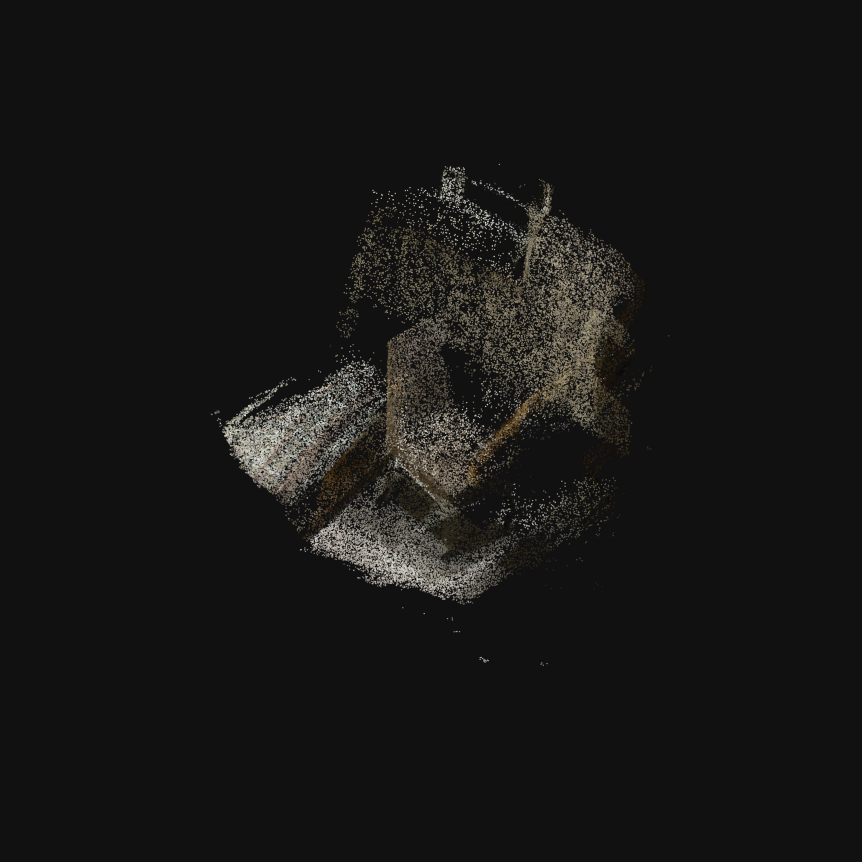

# video-to-3d

Turn a short phone video of a room into a **3D point cloud** — using
[MASt3R](https://github.com/naver/mast3r) (the more accurate successor to
[DUSt3R](https://github.com/naver/dust3r)), a learned, feed-forward 3D model.
No COLMAP and no provided camera calibration, and **no GPU on your own machine**
(it runs on a free Colab T4).

MASt3R predicts a 3D point for every pixel and recovers the camera poses with no
provided calibration and no local COLMAP install. It can be more forgiving than
classical SfM in weak-feature cases, but reconstruction quality still depends on
parallax, lighting, texture, and motion blur.

```
upload video → extract frames → blur filter → subsample → MASt3R → view inline → save .ply
   (ffmpeg)        (CPU)          (CPU)        (CPU)       (GPU)      (plotly)
```

---

## Example result

A ~20 s handheld 180° walk-around of a chair and bench, reconstructed with
MASt3R from **25 frames → ~500k points**:



See [`examples/output/`](examples/output/) for the full result:
[`point_cloud.ply`](examples/output/point_cloud.ply),
an interactive [`preview.html`](examples/output/preview.html) (open in any
browser and rotate), [`report.json`](examples/output/report.json), and the
[input frames](examples/output/images/) that were used.

---

## Quick start (Google Colab — no local GPU)

1. Make sure this repo is on GitHub (see *Pushing to GitHub* below).
2. Open the notebook in Colab:
   `https://colab.research.google.com/github/maheswariridhi/video-to-3d/blob/main/reconstruct.ipynb`
3. **Runtime → Change runtime type → T4 GPU → Save**
4. **Runtime → Run all**, then upload a short clip when prompted.
5. The cloud renders inline. Outputs are saved under `out/` —
   `point_cloud.ply`, `point_cloud_semantic.ply` (if you ran the semantics
   cell), an interactive `preview.html`, and `report.json` — download any of
   them from Colab's Files panel when you need them.

**Capture tip:** a slow 10–30 s sweep of a small room or a desk, walking
*around* objects (not just rotating on the spot), with even lighting and no
motion blur. More parallax = better depth.

---

## Semantic labels (optional)

Cell 5 of the notebook also assigns a **semantic class to each 3D point**. The
approach keeps semantics aligned with the geometry *by construction*:

1. Segment every frame in 2D with **SegFormer (ADE20K)**, which covers indoor
   furniture (chair, sofa, table, bed, cabinet, …).
2. Each pixel already has a 3D point from MASt3R, so every point **inherits its
   pixel's label** — no separate alignment step.
3. **Voxel-majority-vote** across all frames so a point's label is consistent
   across views, not per-frame flicker.

Output: `point_cloud_semantic.ply` (furniture coloured per class, everything else
grey) plus a printed per-class point-count legend. Target classes are
configurable: `semantics.label(rec, target_classes=["chair", "table", ...])`.

---

## Repository layout

```
video-to-3d/
├── reconstruct.ipynb        # ← the Colab notebook you run (6 steps, top to bottom)
├── v3d/                     # the real code, imported by the notebook
│   ├── frames.py            # extract frames + blur filter + subsample   (CPU)
│   ├── reconstruct.py       # MASt3R → coloured point cloud                (GPU)
│   ├── semantics.py         # 2D→3D semantic labels (SegFormer)            (GPU)
│   └── pointcloud.py        # binary-PLY writer + inline 3D viewer        (CPU)
├── examples/                # sample input + committed example outputs
├── requirements.txt
└── README.md
```

The notebook is deliberately thin — each cell just calls a `v3d` function — so
the logic lives in readable, reusable modules rather than in notebook cells.

---

## Roadmap

- [x] CPU frame prep: extraction + blur filter + subsampling
- [x] MASt3R reconstruction on Colab GPU → coloured point cloud
- [x] Inline 3D viewer + PLY export
- [x] Semantic labels in 3D — SegFormer/ADE20K masks lifted onto the MASt3R
      pointmaps and voxel-majority-voted for multi-view consistency
- [ ] Optional: 3D Gaussian Splatting on the recovered poses for a
      photorealistic, explorable result

---

## Design choices

- **Why MASt3R instead of classical SfM.** A learned feed-forward model trades a
  little metric precision for a lot of robustness on casual phone video, removes
  the COLMAP install, produces a dense coloured cloud directly (with accurate
  matching + metric scale), and avoids the "all-or-nothing" failure mode of
  incremental SfM on textureless scenes.
- **Frame prep matters more than the engine.** Sampling at a fixed fps, dropping
  the blurriest frames (relative to the median, with a hard floor), and thinning
  to a few dozen well-spread views is cheap and high-impact — it's also what
  keeps the joint GPU step inside a free T4's memory.
- **Thin notebook, real modules.** All logic sits in `v3d/*.py`; the notebook is
  a 6-step driver. Easy to read, reuse, and run locally if you do have a GPU.
- **Dependency-light I/O.** A hand-rolled binary PLY writer and a plotly viewer
  keep the output portable (MeshLab/CloudCompare/Blender) with no heavy 3D libs.

---

## Pushing to GitHub

```bash
cd video-to-3d
git add .
git commit -m "video-to-3d: MASt3R reconstruction pipeline"
git push
```

The repo must be **public** for the notebook's `git clone` step to work without
authentication (and for submission). You can also add an
[Open in Colab](https://colab.research.google.com/github/maheswariridhi/video-to-3d/blob/main/reconstruct.ipynb)
badge to the top of this README.
